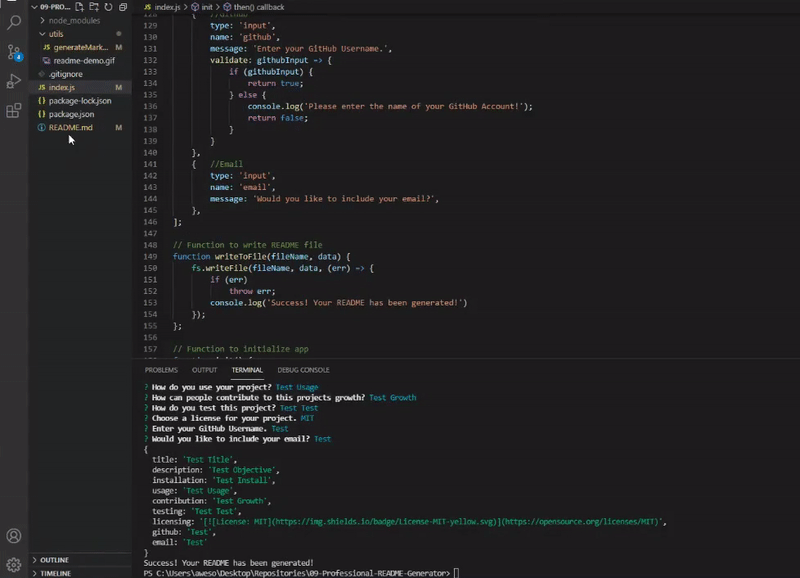

# 09-Professional-Readme-Generator

[](https://opensource.org/licenses/MIT)

  ## Description:
  This is a simple terminal/console based readme generator. Using the npm inquirer package and Node.js; the user is prompted for information to generate their custom readme/markdown file.

  

  ## Table of Contents 
  - [Description](#description)
  - [License](#license)
  - [Installation](#installation)
  - [Usage](#usage)
  - [Testing](#testing)
  - [Contribution](#contribution)
  - [Additional Info](#additional-info)

  ## License:
  [](https://opensource.org/licenses/MIT)

  ## Installation:
  Clone the code repository:
  ```
  git@github.com:OmarAce/09-Professional-README-Generator.git
  ```
  Ensure that Node is installed:
  ```
  https://nodejs.org/en/
  ```
  Ensure that the Inquirer Package is installed:
  ```
  npm i inquirer
  ```

  ## Usage:
  -Open your terminal\
  -type:
  ```
  node index.js
  ```
  -Follow Prompts

  ## Questions:
  Have any questions?\
  Feel free to contact me at:
  - Github: [OmarAce](https://github.com/OmarAce)
  - Email: omarace95@gmail.com